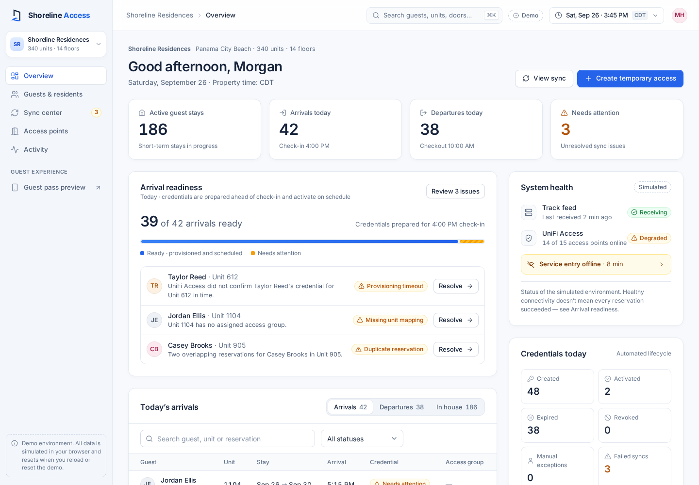

# Shoreline Access — demo

A clickable demo of a guest and owner access system for **Shoreline Residences**, a fictional 340-unit, 14-floor beachfront condominium in Panama City Beach, Florida. It shows the workflow for a custom Track Hospitality → UniFi Access integration: management can see immediately whether arriving guests will have access, understand any problem, and resolve the exception.

<p align="center"></p>



> **Demo only.** Every person, reservation, credential, PIN, QR code and number is invented. Nothing connects to Track, UniFi, email or SMS. There is **no database**: all state lives in memory and resets when you reload the page or choose **Reset demo**.

**The app is a static site.** By default the demo API runs **inside the browser**, so it deploys to GitHub Pages with no server. An equivalent ASP.NET Core API is in `backend/` for when a real server is needed. Both implement the same vertical slices, contracts and rules, and a build flag switches between them.

| Layer | Stack |
| --- | --- |
| Frontend | Angular 22 (standalone components, signals, `httpResource`, reactive forms, zoneless), SCSS design tokens, Inter (bundled), Lucide icons (bundled) |
| Demo API, in browser (default) | TypeScript port of the API slices in `frontend/src/app/demo-api/`, served through an `HttpInterceptor`; Vitest tests |
| Demo API, server (optional) | ASP.NET Core 10 minimal API, **vertical slice architecture**, in-memory state, xUnit integration tests |

## Architecture

### Backend — vertical slices

Each use case is one file that contains its request/response contract, validation, handler and endpoint mapping. Endpoints are discovered through `IEndpoint`, so adding a feature never touches `Program.cs`. There are no controllers, service layers or repositories to thread through.

```text
backend/
  src/Shoreline.Api/
    Program.cs                    composition root (JSON, ProblemDetails, OpenAPI, static SPA)
    Common/                       IEndpoint discovery, Validator, PropertyTime, QueryEnum<T>
    Domain/                       entities + AccessRules (the single "is access active?" rule)
    Infrastructure/Demo/          DemoStore (lock-guarded in-memory state), deterministic fixtures, demo clock
    Features/
      Overview/     GetOverview, ListStays
      People/       ListPeople, GetPerson, ExtendAccess, RevokeAccess,
                    GetMessagePreview, ResendMessage, CreateTemporaryAccess
      Sync/         GetSyncCenter, RunSync, RetryIssue, MapUnit, ChooseReservation, SetScenario
      AccessPoints/ ListAccessPoints, GetAccessPoint
      Activity/     ListActivity
      GuestPass/    GetGuestPass
      Search/       GlobalSearch
      Demo/         GetDemoState, AdvanceClock, ResetDemo
      Shared/       PersonSummary row contract + stay segments shared by read slices
  tests/Shoreline.Api.Tests/      AccessRules unit tests + end-to-end demo-script tests
```

Key rules live in `Domain/AccessRules.cs`:

- Credential lifecycle (`scheduled/active/expired/revoked`), provisioning (`pending/succeeded/failed`) and reservation state (`confirmed/cancelled`) are stored separately and combined only there.
- Access is active only when provisioning succeeded, the credential isn't revoked, the reservation is confirmed, and the demo clock is inside the window. Check-in is inclusive and checkout is exclusive. Staff and vendor schedules are evaluated in property time.
- Failed or pending provisioning never produces active access, and the guest pass never exposes a PIN or QR for it.
- Revocation always wins, even after the clock moves forward.
- Provisioning is idempotent. A retry of a completed operation returns `alreadyResolved` and never writes a second credential.

### In-browser demo API

`frontend/src/app/demo-api/` mirrors the C# slices one to one: `features/overview.ts`, `people.ts`, `sync.ts`, `access-points.ts`, `activity.ts`, `guest-pass.ts`, `search.ts` and `demo.ts`, plus `domain.ts` (including `AccessRules`), deterministic `fixtures.ts` using the same generator and seed, and property-time helpers. `inBrowserApiInterceptor` answers every `api/...` request from memory. It applies the same short simulated latency to mutations and returns the same RFC 7807 validation problems, so the UI can't tell it apart from the server.

### Frontend — feature folders

```text
frontend/src/app/
  core/          API contracts, DemoState (clock/scenario + revision signal), liveResource, property-time utils, panels, toasts
  layout/        admin shell, sidebar, top bar, demo-controls menu, global search (⌘K)
  shared/ui/     icon, status badge, avatar, metric tile, dialog surface (native <dialog>), toast outlet,
                 activity timeline, credential card, QR code, empty state, skeleton, brand mark
  features/
    overview/  people/ (directory, person drawer, temporary access)  sync/  access-points/  activity/  guest-pass/
```

Every read goes through `liveResource()`, an `httpResource` keyed on a shared `revision` signal. Every mutation calls `DemoState.mutate()`, which bumps the revision. All visible screens then refetch from the one server-side state, so counts, histories and statuses always agree.

Drawers and dialogs use the native `<dialog>` element: the browser provides the focus trap, Escape handling and top-layer stacking, and focus returns to the element that opened them. Routing uses `withHashLocation()`, so deep links and refreshes work on any static host.

## Run locally

Requirement: **Node.js 24** (`frontend/.nvmrc`). No backend is needed.

```bash
cd frontend
npm ci
npm start            # http://localhost:4200 — demo API runs in the browser
npm test             # Vitest: lifecycle boundaries, revocation, retry idempotency, shared counts
npx ng build         # static site → frontend/dist/frontend/browser
```

The app opens straight onto the dashboard; there is no sign-in.

### Optional: run against the C# API

Requirement: **.NET SDK 10**.

```bash
cd backend && dotnet run --project src/Shoreline.Api     # http://localhost:5080
cd frontend && npm run start:server                     # proxies /api to the API
cd backend && dotnet test
```

`npm run build:server` produces a build that calls the real API. The `Dockerfile` packages that API together with the SPA into one container (`docker build -t shoreline-access .`). Run a single instance, because state is in memory.

## Deploy to GitHub Pages

`.github/workflows/deploy-pages.yml` tests the app, builds it with `--base-href /<repo>/`, and publishes `frontend/dist/frontend/browser` with the official Pages actions.

1. Push the branch and merge it to `main`. You can also run the workflow manually from the **Actions** tab.
2. In the repository, open **Settings → Pages** and set **Source** to **GitHub Actions**.
3. The site is published at `https://<owner>.github.io/<repo>/`, for example `https://deadendgg.github.io/shoreline/`.

The app uses hash routing (`withHashLocation()`), so deep links such as `…/shoreline/#/guest/avery-morgan` and page refreshes work without server rewrite rules. All assets are referenced relative to `<base href>`. For a user or organisation site, or a custom domain, change the workflow's `--base-href` to `/`. No credentials or secrets are needed.

CI (`.github/workflows/ci.yml`) additionally builds and tests the C# API, both frontend build modes, and the container image.

## Demo controls

- **Demo clock** (top bar): the fixed start is Saturday, September 26, 2026, 3:45 PM Central.
  - **Advance to check-in** moves to 4:00 PM. Arrival credentials become active, and each transition is logged.
  - **Advance to checkout** moves to Saturday, October 3, 10:00 AM. Avery's stay ends at exactly 10:00 AM, and every expiration crossed along the way is logged.
  - **Reset demo** restores the clock, records and scenario.
- **Demo scenario** (Sync center): *Normal operation*, *Track feed unavailable*, or *Provisioning interrupted*.
- **Global search**: ⌘K / Ctrl+K or `/`.

## Routes

| Route | Screen |
| --- | --- |
| `#/overview` | Arrival readiness, metrics, system health, recent activity |
| `#/people` | Directory. Accepts `?segment=activeStays\|arrivalsToday\|departuresToday`, `?type=`, `?status=`, `?q=` |
| `#/sync` | Sync center. Accepts `?filter=open\|resolved\|all`, `?issue=<id>` |
| `#/access-points` | Fifteen access points, grid or table view |
| `#/activity` | Audit trail |
| `#/guest/:id` | Stand-alone guest pass, e.g. `#/guest/avery-morgan` |

## Three-minute walkthrough

1. **Overview (0:00–0:30).** Show 42 arrivals with 39 ready and the three exceptions. Management sees problems before check-in.
2. **Unit 807 (0:30–1:10).** Click *Avery Morgan* in Today's arrivals. Show the permitted locations, the scheduled window and **Preview guest pass**. Then use **Demo clock → Advance to check-in**: the credential becomes *Active* in the drawer, the table and the pass.
3. **Resolve a failure (1:10–1:50).** Click *Resolve* next to Taylor Reed (or go to Sync center) and choose **Retry provisioning**. The timeline shows success and readiness moves from 39/42 to 40/42. Jordan (unit mapping) and Casey (duplicate reservation) each need a reviewed decision; a retry won't fix them.
4. **Track outage (1:50–2:20).** In Sync center, choose **Track feed unavailable**. The feed goes stale, a failed run is logged, and upcoming arrivals are flagged. Switch back to **Normal operation**.
5. **Automatic expiration (2:20–2:45).** Use **Advance to checkout**. Avery's pass changes to *Stay ended* at exactly 10:00 AM, and Activity records the expiration.
6. **Close (2:45–3:00).** The prototype shows the management workflow. A hardware/API proof of concept would validate the real integration next.

Choose **Reset demo** before the next presentation.

## What this demo does not establish

It doesn't validate Track API, webhook or export availability, UniFi credential-method support, schedule enforcement, offline operation, camera streaming, or emergency-access procedures. The PIN and QR are illustrative, and the QR payload is an inert string. The next real milestone is a proof of concept on one or two gates with test reservations and observed activation and revocation.
